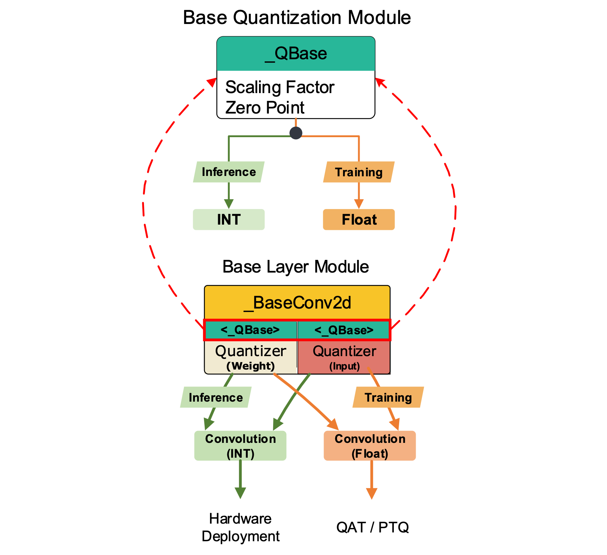

# Basic Modules

The overall design of Torch2Chip follows the *hierarchical design* for customized compression algorithms, including both pruning and quantization. The following document introduces basic modules and the proposed "Dual-Path" design process.

## Dual Path Design

Different from the non-deployable computation path of most quantization algorithms, Torch2Chip employs the "Dual-Path" design, which separates the training and inference computation graph to support both floating-point-based "fake quantization" for training, and low precision-only (e.g., integer, low precision floating point) computation for hardware verification and parameter extraction.

The Dual-Path design is the **most important** design rule of Torch2Chip, starting from the basic quantizer modules all the way to the layers and top-level trainers. 



## `QBase` 

Basic quantization module for customized quantization methods. **[[Source]]()**

```python
class _QBase(nn.Module):
    r"""Base quantization method for weight and activation.

    Args:
    nbit (int): Data precision.
    train_flag (bool): Training mode. 

    Methods:
    trainFunc (input:Tensor): Training function of quantization-aware training (QAT)
    evalFunc (input:Tensor): Forward pass function of inference. 
    inference(): Switch to inference mode. 
    """
    def __init__(self, nbit:int, train_flag:bool=True, unsigned:bool=True):
```

**Parameters**

- `nbit`: Bit precision (e.g., 8, 6, 4, ...).
- `train_flag`: Flag that signifies the training or inference path, which can be specified at initialization or on the model level `inference` mode.
- `scale`: Scaling factor of quantization, (if the scaling factor is learnable (or computed based on the `nn.Parameter`), the scaling factor should be updated inside the quantization function `q`, and the buffer parameter `scale` will be utilized in the post-training conversion and export. 
- `zero_point`: Zero point (distribution offset) of the quantization process (`default = 0.0`). 

#### `observer`

Quantization observer (customizable for different methods) that monitors the dynamic range of the incoming floating point distribution (weight and activation). 

#### `register_qparams`

Register the quantization parameters (`scale` and `zero point`) as buffer parameters.

#### `trainFunc`

 Given the high precision floating point input (`torch.Tensor`), training path (`trainFunc`) performs the normal quantize & dequantize (for integer) or quantize & scaling (for low precision floating point) operation with the high precision floating-point values. 

#### `evalFunc`

Evaluation path that performs the integer-only quantization (no dequantization or secaling). The output of the evaluation path only contains the quantized value, which will be directly fused in the T2C export (`nn2chip`) phase. 

**Note:** As the initial commit, the exact output of `evalFunc` is still in the data type of `torch.float32` or `torch.float16` (e.g., `torch.Tensor([8.])`), whereas the final output of the T2C will convert it into the actual integer data type. 

#### `q`

Shared quantization operations between `trainFunc` and `evalFunc`: 

- Compute / update the scaling factor `self.scale` and `self.zp`
- Connect the quantization to the customized `Autograd` function (if necessary).
- Quantization / Dequantization steps activated by the flag of `self.train_flag`.

## `QBaseConv2d`

Basic convolutional layer compatible for T2C compression.  

```python
class _QBaseConv2d(nn.Conv2d):
    r"""
    Basic low precision convolutional layer

    Inherited from the base nn.Conv2d layer.
    
    Args:
    wbit (int): Weight quantization precision. 
    abit (int): Input quantization precision.
    wq (_QBase): Weight quantizer. 
    aq (_QBase): Activation quantizer.   
    """
    def __init__(self, in_channels:int, out_channels:int, kernel_size:int, stride:int=1, 
                padding:int=0, dilation:int=1, groups:int=1, bias:bool=True, wbit:int=32, abit:int=32, train_flag=True):
        super(_QBaseConv2d, self).__init__(in_channels, out_channels, kernel_size, stride, padding, dilation, groups, bias)
```

Basic convolutional layer for low precision and sparse operations. [**[Source]**]()

**Parameters:**

- The configurations of the convolutional layer follows the settings of the vanilla `nn.Conv2d` of PyTorch. The detailed document is available on the official website ([**link**](https://pytorch.org/docs/stable/generated/torch.nn.Conv2d.html#conv2d))
- `wbit (int)`: Target precision of `weight` (default = 32).
- `abit (int)`: Target precision of activation (default = 32).
- `train_flag (bool)`: Flag that signifies the training or inference path, which can be specified at initialization or on the model level `inference` mode.
- `qweight (torch.Tensor)`: Buffer parameter which stores the low precision weights, which will be copied into the vanilla layer as the replica in the T2C export phase (`nn2chip`). To save memory during training, `qweight` will be registered **only** when the inference mode is activated. 

**Attributes:**

- `wq (_QBase)`: Weight quantizer (default = `nn.Identity()`). 
- `aq (_QBase)`: Activation quantizer (default = `nn.Identity()`). 
- `yq (_QBase)`: Output quantizer (default = `nn.Identity()`). 


#### `inference`

Switch to inference mode: 

- Switch the quantizers (`wq` and `aq`) to inference mode.
- Define the basic operation (`ops` = `ConvOPS`). 
  - **Note:** The basic conv operation (`ConvOPS`) only perform the low-precision **only** convolution. The bias will be fused externally into the subsequent fusers. 


## `QBaseLinear`

Basic Linear layer compatible for T2C compression. 

```python
class _QBaseLinear(nn.Linear):
    r"""Basic low precision linear layer

    Inherited from the base nn.Linear layer.
    
    Args:
    wbit (int): Weight quantization precision. 
    abit (int): Input quantization precision.
    wq (_QBase): Weight quantizer. 
    aq (_QBase): Activation quantizer.
    """
    def __init__(self, in_features: int, out_features: int, bias: bool = True, wbit:int=32, abit:int=32, train_flag=True):
        super(_QBaseLinear, self).__init__(in_features, out_features, bias)
```

Basic fully-connected layer for low precision and sparse operations

**Parameters:**

- The configurations of the convolutional layer follows the settings of the vanilla `nn.Linear` of PyTorch. The detailed document is available on the official website ([**link**](https://pytorch.org/docs/stable/generated/torch.nn.Linear.html#linear))
- `wbit (int)`: Target precision of `weight` (default = 32).
- `abit (int)`: Target precision of activation (default = 32).
- `train_flag (bool)`: Flag that signifies the training or inference path, which can be specified at initialization or on the model level `inference` mode.
- `qweight (torch.Tensor)`: Buffer parameter which stores the low precision weights, which will be copied into the vanilla layer as the replica in the T2C export phase (`nn2chip`). To save memory during training, `qweight` will be registered **only** when the inference mode is activated. 

**Attributes:**

- `wq (_QBase)`: Weight quantizer (default = `nn.Identity()`). 
- `aq (_QBase)`: Activation quantizer (default = `nn.Identity()`). 
- `yq (_QBase)`: Output quantizer (default = `nn.Identity()`). 

#### `inference`

Switch to inference mode: 

- Switch the quantizers (`wq` and `aq`) to inference mode.
- Define the basic operation (`ops` = `MatMul`). 
  - **Note:** The basic conv operation (`MatMul`) only perform the low-precision **only** Matrix Multiplication. The bias will be fused externally into the subsequent fusers. 

## `QAttention`

Basic Attention Module compatible for T2C compression. The original implementation is adopted from `timm`. 

```python
class QAttention(nn.Module):
    def __init__(
            self,
            dim:int,
            num_heads, 
            qkv_bias=False,
            qk_norm=False, 
            attn_drop=0.0,
            proj_drop=0.0,
            norm_layer=nn.LayerNorm
    ):
        super().__init__()
        assert dim % num_heads == 0,"dim should be divisible by num_heads"
```

`QAttention` module can be considered as a direct replica of the vanilla `Attention` module of the `timm` library. The input arguments shares the same layout as the vanilla Attention. The major difference is the separation between the training and inference paths. 

**Attributes:**

- `xq (_QBase)`: Input quantizer. 
- `qproj (_QBase)`: Quantize the MatMul results between Attention and Value (`self.attnv`)
- `qqkv (_QBase)`: Shared quantizer of Q, K, and V.

**Training path:**

Normal attention-softmax-projection operations as before

```python
def trainFunc(self, q, k, v):
    attn = q @ k.transpose(-2, -1)  # out dim = token x token
    attn = self.attn_scale(attn)

    attn = F.softmax(attn, dim=-1)
    attn = self.attn_drop(attn)

    x = attn @ v                    # out dim = token x head_dim
    x = self.qproj(x)

    return x
```

**Inference path:**

```python
def evalFunc(self, q, k, v):
    attn = self.qk(q, k.transpose(-2, -1))
    attn = self.attn_scale(attn)

    attn = F.softmax(attn, dim=-1)
    attn = attn.mul(255.).round()

    attn = self.attn_drop(attn)

    x = self.attnv(attn, v)
    x = self.qproj(x)

    return x.float()
```

The matrix multiplication operands are replaced as the `IntMatMul` modules. During the export phase of T2C, the intermediate results of the matmul will be exported based on the location of the `IntMatMul`:

- `qk`: Matrix multiplication operand between Q and K.
- `attnv`: Matrix multiplication operand between attention and V.

**By default, the output of the softmax is quantized to unsigned INT8 (0 to 255) in the inference path.** 

- The potential accuracy degradation caused by the low precision softmax will be resolved in future work. 

#### `inference`

Switch to inference mode: 

- Switch all the weight quantizers (`self.qkv` and `self.proj`) to inference mode. 
- Switch all the tensor quantizer (`self.xq`, `self.qqkv` `self.qproj`) to inference mode.
- Activate the basic `ops` and replace the normal operation (`torch.nn.functional.linear`) to `Matmul`. 
- `self.qk(MatMul)`: Matrix multiplication operator between Query (Q) and Key (K).
- `self.attv(MatMul)`: Matrix multiplication operator between Attention and Value (V). 

## `QWindowAttention`

Basic Attention Module for SwinTransformer compatible for T2C compression. The original implementation is adopted from `timm`. 

```python
class QWindowAttention(nn.Module):
    """ Window based multi-head self attention (W-MSA) module with relative position bias.
    It supports shifted and non-shifted windows.

    Full precision version is adopted from timm. 
    Quantizers are added for T2C
    """

    def __init__(
            self,
            dim: int,
            num_heads: int,
            head_dim = None,
            window_size = 7,
            qkv_bias: bool = True,
            attn_drop: float = 0.,
            proj_drop: float = 0.,
    ):
        """
        Args:
            dim: Number of input channels.
            num_heads: Number of attention heads.
            head_dim: Number of channels per head (dim // num_heads if not set)
            window_size: The height and width of the window.
            qkv_bias:  If True, add a learnable bias to query, key, value.
            attn_drop: Dropout ratio of attention weight.
            proj_drop: Dropout ratio of output.
        """
```

Similar to the `QAttention` module, `QWindowAttention` is a dedicated module designed for low precision attention and T2C conversion computation. Similarly, `QWindowAttention` follows the similar design logic with `training` and `inference` paths.

**Attributes:**

- `xq (_QBase)`: Input quantizer. 
- `qproj (_QBase)`: Quantize the MatMul results between Attention and Value (`self.attnv`)
- `qqkv (_QBase)`: Shared quantizer of Q, K, and V.


**Training path:**

Normal attention-softmax-projection operations with mask + High precision softmax:

```python
def trainFunc(self, q, k, v, B:int, N:int, mask: torch.Tensor = None):
        attn = q @ k.transpose(-2, -1)
        attn = self.attn_scale(attn)
        attn = attn + self._get_rel_pos_bias()

        if mask is not None:
            num_win = mask.shape[0]
            attn = attn.view(-1, num_win, self.num_heads, N, N) + mask.unsqueeze(1).unsqueeze(0)
            attn = attn.view(-1, self.num_heads, N, N)

        attn = self.softmax(attn)
        attn = self.attn_drop(attn)
        x = attn @ v
        x = x.transpose(1, 2).reshape(B, N, -1)
        x = self.qproj(x)
        return x
```

**Inference path:**

```python
def evalFunc(self, q, k, v, B:int, N:int, mask: torch.Tensor = None):
        q, k, v = q.double(), k.double(), v.double()
        attn = self.qk(q, k.transpose(-2, -1))
        
        # pos_bias is fused into the scaler
        attn = self.attn_scale(attn)
        attn = attn + self._get_rel_pos_bias()

        if mask is not None:
            num_win = mask.shape[0]
            attn = attn.view(-1, num_win, self.num_heads, N, N) + mask.unsqueeze(1).unsqueeze(0)
            attn = attn.view(-1, self.num_heads, N, N)
        
        attn = self.softmax(attn)
        attn = attn.mul(255.).round()

        attn = self.attn_drop(attn)

        x = self.attnv(attn, v)
        x = x.transpose(1, 2).reshape(B, N, -1)
        x = self.qproj(x)
        return x.float()
```

#### `inference`

Switch to inference mode: 

- Switch all the weight quantizers (`self.qkv` and `self.proj`) to inference mode. 
- Switch all the tensor quantizer (`self.xq`, `self.qqkv` `self.qproj`) to inference mode.
- Activate the basic `ops` and replace the normal operation (`torch.nn.functional.linear`) to `Matmul`. 
- `self.qk(MatMul)`: Matrix multiplication operator between Query (Q) and Key (K).
- `self.attv(MatMul)`: Matrix multiplication operator between Attention and Value (V). 


## `QBertSelfAttention` (Beta)

Basic Attention Module from BERT (`transformer` developed by HuggingFace) compatible for T2C compression. 

```python
class QBertSelfAttention(nn.Module):
    def __init__(self, config, position_embedding_type=None):
        super().__init__()
```

Currently, Torch2Chip mainly support the encoding process based on the compressed BERT model. 

- [ ] **[04/18/24]:** We will support the decoder-based language model in the near future. 

The input `config` and `position_embedding_type` inherits directly from the `BertSelfAttention` module of `transformer==4.39.2` ([link](https://github.com/huggingface/transformers/blob/01ae3b87c0c9ae5267a1f15edcc93715a78e1975/src/transformers/models/bert/modeling_bert.py#L219)). 

**Attributes:**

- `xq (_QBase)`: Input quantizer. 
- `qquery (_QBase)`: Dedicated quantizer of Query.
- `qkey (_QBase)`: Dedicated quantizer of Key.
- `qvalue (_QBase)`: Dedicated quantizer of Value.
- `qkv_deq (_MulShift)`: Dequantizer affter Attention and Value Matmul.   

Unlike the `Attention` module and the `WindowAttention` module that we used for Vision Transformers, the self-attention of BERT model separates the computation of Query, Key, and Value layers with **3**  dedicated layers.

**Training Path:**

The `trainFunc` of the module inherits the same forward pass as the vanilla module of `transformer` library. The quantizers (with training mode) are plugged into the `trainFunc`. For instance, for the fake-quantization of Query, we have:

```python
hidden_states = self.xq(hidden_states)
mixed_query_layer = self.query(hidden_states)

# low precision Q
mixed_query_layer = self.qquery(mixed_query_layer)
```

**Evaluation Path:**

```python
def evalFunc(self, hidden_states: torch.Tensor, **kwargs) -> Tuple[torch.Tensor]:
        hidden_states = self.xq(hidden_states)

        # Q
        mixed_query_layer = self.query(hidden_states)
        mixed_query_layer = self.qquery(mixed_query_layer)
        query_layer = self.transpose_for_scores(mixed_query_layer)
        
        # K
        key = self.key(hidden_states)
        key_layer = self.qkey(key)
        key_layer = self.transpose_for_scores(key_layer)

        # V
        value = self.value(hidden_states)
        value_layer = self.qvalue(value)
        value_layer = self.transpose_for_scores(value_layer)
        
        # Take the dot product between "query" and "key" to get the raw attention scores.
        attention_scores = self.qk(query_layer, key_layer.transpose(-1, -2))
        attention_scores = self.attn_scale(attention_scores)
        
        if attention_mask is not None:
            # Apply the attention mask is (precomputed for all layers in BertModel forward() function)
            attention_scores = attention_scores + attention_mask

        # Normalize the attention scores to probabilities.
        attention_probs = nn.functional.softmax(attention_scores, dim=-1)
        attention_probs = self.dropout(attention_probs)

        # Mask heads if we want to
        if head_mask is not None:
            attention_probs = attention_probs * head_mask

        # round the attention score to 8-bit (fixed)
        attention_probs = attention_probs.mul(256.).round()

        context_layer = self.attnv(attention_probs, value_layer)
        context_layer = self.qkv_deq(context_layer)

        context_layer = context_layer.permute(0, 2, 1, 3).contiguous()
        new_context_layer_shape = context_layer.size()[:-2] + (self.all_head_size,)
        context_layer = context_layer.view(new_context_layer_shape)

        outputs = (context_layer, attention_probs) if output_attentions else (context_layer,)
        return outputs
```

