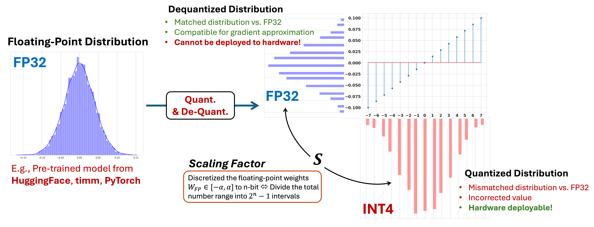

# DNN Compression

Driven by the desire of energy-efficient DNN computation, compression aims to either reduce the precision of the model representation (quantization) or remove the redundant paramters from the model itself (pruning). In Torch2Chip, we support the collective compression with **both** low precision quantization and sparsity. 

## Quantization

Quantization has been one of the most dominant methods for model compression. Essentially, quantization can be considered as a process of aligning the original floating-point distribution with a pre-defined "grid" with different data precisions (e.g., INTX, FPX). 

### Low Precision Integer Quantization

The integer-only quantization can be generalized as:

$$
X_Q = \text{round}(\frac{X_{FP}}{S_x}) + \text{zero point}
$$


Where \(S_x\) represents the scaling factor of the quantization. 

In practice, the quantization process is implemented as:

```python
xq = torch.round(x / self.scale)
```

Where `scale` is defined by the range of the floating point distribution (clipped or non-clipped) and the target data precision `n`. 




#### Scaling factor: Size of the interval

Scaling factor defines the interval between two adjacent levels after **dequantization.** Naturally, given the distribution with the floating point range = $[\alpha, \beta]$ and precision $n$​, the scaling factor is defined as:


$$
S = \frac{\beta - \alpha}{2^n - 1}
$$


Naturally, it is easy to tell that the total number of "intervals" after quantization is $2^n-1$, defined by the lower bound and upper bound of the quantization range (not floating point range), which is also characterized by the "signed" and "unsigned" data format. 

- **Signed integer:** Upper bound `qub` = \(2^{n-1}-1\) ; Lower bound `qlb` = \(-2^{n-1}\)
- **Unsigned integer:** Upper bound `qub` = \(2^n-1\); Lower bound `qlb` = 0.

Both signed and unsigned integer leads to the total number of intervals = \(2^n-1\). 

#### Zero Point: Distribution Shifter

In practice, the data range of the floating point distribution could be mismatched with the quantization range of the target data format (signed or unsigned). As a result, an offset is needed to correct the range of distribution. 

Specifically, zero point is computed as the difference between the rounded floating point range and target lower bound of quantization: 

```python
zero_point = self.qlb - torch.round(self.lb / self.scale)
```

 Where `self.lb` , `self.qlb` represents the low bound of the original distribution (high precision) and the lower bound of quantization range. 

In Torch2Chip, scaling factors and zero point are defined as the basic "quantization parameters" (`qparams`), which will be registered directly under the `_QBase` : 

```python
def register_qparams(self):
    # register quantization scaler and zero point
    self.register_buffer("scale", torch.tensor(1.0))
    self.register_buffer("zero_point", torch.tensor(0.0))
```

Overall, the quantization process is summarized as:

```python
xr = torch.round(x / self.scale) + self.zero_point
xq = torch.clamp(xr, min=self.qlb, max=self.qub)
xq = xq.sub(self.zero_point)

# dequantize
if self.dequantize:
    xdq = xdq.mul(self.scale)
```

### Observers

In Torch2Chip, the statistics (e.g., lower bound, upper bound) of the incoming tensor is captured by different observers, corresponding to different quantization method proposed by the prior research works.  Starting from the base quantizer (`_QBase`), the observer is a necessary part of the quantization process.

#### `BaseObserver` [[Source](https://github.com/SeoLabCornell/torch2chip/blob/61b3ef32fdd68f3d576c00bca1a4fc977ea1a18d/src/quantization/observer.py#L8)]

```python
class BaseObserver(nn.Module):
    def __init__(self, nbit:int, unsigned:bool=True):
        super().__init__()
```

**Attributes:**

- `nbit`: Target precision of quantization.
- `unsigned`: Target data type (signed or unsigned integer).
- `initialize`: Initialization flag. 

##### `register_range(self)`

Register the buffer to record the numerical range in the high-precision floating point domain. 

- `self.lb`: Lower bound of the floating point distribution (default = `torch.tensor("-inf")`)
- `self.ub`: Upper bound of the floating point distribution (default = `torch.tensor("inf")`). 

##### `calculate_qparam(self, x:torch.Tensor)`

Calculate the quantization parameters (scaling factor and zero point) based on the updated upper and lower bound. 

**Output:**

Calculated quantization parameter 

#### `BaseChannelWiseObserver` [[Source](https://github.com/SeoLabCornell/torch2chip/blob/61b3ef32fdd68f3d576c00bca1a4fc977ea1a18d/src/quantization/observer.py#L69)]

Inherited from `BaseObserver`,  the channel-wise observer capture the numerical range along the channels of weight tensor. 

- `num_channels`: Number of channels of a given layer, defined at the begining of compression. 

- `self.lb`: Lower bound of the floating point tensor (shape = `self.num_channels`). 
- `self.ub`: Upper bound of the floating point tensor (shape = `self.num_channels`). 

#### `BaseTokenWiseObserver ` [[Source](https://github.com/SeoLabCornell/torch2chip/blob/61b3ef32fdd68f3d576c00bca1a4fc977ea1a18d/src/quantization/observer.py#L107)]

Inherited from `BaseObserver`, the token-wise observer capture the numerical range along the token dimension of the weight tensor. 

- `num_tokens`: Number of tokens of a given model, defined at the begining of compression. 

- `self.lb`: Lower bound of the floating point tensor (shape = `self.num_tokens`).  
- `self.ub`: Upper bound of the floating point tensor (shape = `self.num_tokens`). 

### Convert Faked Quantized Ops to Low-precision Ops

By default, the quantized tensor \(X_Q\) requires dequantization during training (PTQ, QAT) to ensure the numerical stability:
$$
X_{DQ} = S_X(X_Q - \text{zero point})
$$
Given the weight tensor \(X^L\) and weight tensor \(W^L\) of layer \(L\), the dequantize process can be factorized out:
$$
Y = S_WS_X(X_Q \cdot W_Q)
$$
For simplicity, we assume the zero point = 0. By doing so, the operation (e.g., MatMul, Convolution) between \(X_Q, W_Q\) is compressed. 

In practice, the accuracy-driven quantization requires different granularity schemes for weight and activation. Therefore, the fusion of the scaling factors should be individually treated for different schemes ([ViT Example](https://github.com/SeoLabCornell/torch2chip/blob/61b3ef32fdd68f3d576c00bca1a4fc977ea1a18d/src/t2c/fusers/vit.py#L26)).

### Quantization Methods

The objective of Torch2Chip is enabling the systematic design of compression. Starting from customized compression algorithm, all the way to the fully quantized and observable tensors (intermediate results).

In terms of customization, Torch2Chip support recent state-of-the-art (SoTA) quantization algorithms, together with different quantization granularities (tensor-wise, token-wise, channel-wise).

- **Note:** We are continously adding different quantization algorithms into Torch2Chip! 

In Torch2Chip, all the quantization methods follows the structure of 1) Quantizer (inherited from `_QBase`),  2) Observer (`_BaseObserver`), and 3) Properly calculated and stored quantization parameters (`qparams`).

#### MinMax Quantization

Simplest quantization strategy which takes the minimal and maximal value of the distribution as the upper bound of lower bound of quantization.

##### `MinMaxQuantizer` [[Source](https://github.com/SeoLabCornell/torch2chip/blob/61b3ef32fdd68f3d576c00bca1a4fc977ea1a18d/src/quantization/minmax.py#L74)]

```python
class MinMaxQuantizer(_QBase):
  def __init__(self, nbit: int, train_flag: bool = True, unsigned: bool = True):
        super().__init__(nbit, train_flag, unsigned)
	
  			# observer
        self.observer = MinMaxObserver(nbit=self.nbit, unsigned=self.unsigned)
```

**Tensor-wise quantizer** with single scaling factor and zero point, which are computed by observing the minimal and maximal bound of the incoming distribution (e.g., weight. activation). 

##### `MinMaxChannelWiseWeightQuantizer` [[Source](https://github.com/SeoLabCornell/torch2chip/blob/61b3ef32fdd68f3d576c00bca1a4fc977ea1a18d/src/quantization/minmax.py#L141)]

```python
class MinMaxChannelWiseWeightQuantizer(MinMaxQuantizer):
    def __init__(self, nbit: int, train_flag: bool = True, unsigned: bool = False, num_channels:int = 1):
        self.num_channels = num_channels
        super().__init__(nbit, train_flag, unsigned)

        # observer
        self.observer = MinMaxChannelWiseWeightObserver(nbit=self.nbit, unsigned=unsigned)

        # qparams
        self.register_qparams()
```

**Channel-wise quantizer** for weight tensors. The observer (`MinMaxChannelWiseWeightObserver`) and quantization parameters (`scale` and `zero_point`) are designed to match the channel-dimension of the incoming tensor, for both convolutional neural network and transformer architectures. 

##### `MinMaxTokenWiseQuantizer` [[Source](https://github.com/SeoLabCornell/torch2chip/blob/61b3ef32fdd68f3d576c00bca1a4fc977ea1a18d/src/quantization/minmax.py#L104)]

```python
class MinMaxTokenWiseQuantizer(MinMaxQuantizer):
    def __init__(self, nbit: int, train_flag: bool = True, unsigned: bool = True, num_tokens: int = 197):
        self.num_tokens = num_tokens
        super().__init__(nbit, train_flag, unsigned)

        # observer
        self.observer = MinMaxTokenWiseObserver(nbit=self.nbit, unsigned=self.unsigned, num_tokens=num_tokens)

        # qparams
        self.register_qparams()
```

**Token-wise quantizer** for activation tensors.  The observer (`MinMaxChannelMinMaxTokenWiseObserver`) and quantization parameters (`scale` and `zero_point`) are designed to match the token-dimension of the incoming tensor, **for transformer architecture only.**

##### `MinMaxObserver` [[Source](https://github.com/SeoLabCornell/torch2chip/blob/61b3ef32fdd68f3d576c00bca1a4fc977ea1a18d/src/quantization/minmax.py#L9)]

```python
class MinMaxObserver(BaseObserver):
    def __init__(self, nbit: int, unsigned: bool = True):
        super().__init__(nbit, unsigned)
```

**Tensor-wise Observer.** Track the minimal and maximal value of the incoming tensor (for weight or activation) in the forward pass. Given the total number of calibration samples = \(N\), `MinMaxObserver` continously update the upper bound and lower bound of the quantization range (`lb` and `ub`). 

```python
lb = torch.min(self.lb, min_val)
ub = torch.max(self.ub, max_val)

# update bound
self.lb.copy_(lb)
self.ub.copy_(ub)
```

**Note:** The quantization parameters of `MinMaxQuantizer` and `MinMaxObserver` will remain **fixed** during the post-quantization inference. Dynamically calculating the quantization parameter on the fly leads to the repetitive sorting and hardware overhead. 

##### `MinMaxChannelWiseWeightObserver` [[Source](https://github.com/SeoLabCornell/torch2chip/blob/61b3ef32fdd68f3d576c00bca1a4fc977ea1a18d/src/quantization/minmax.py#L25)]

```python
class MinMaxChannelWiseWeightObserver(BaseChannelWiseObserver):
    def __init__(self, nbit: int, unsigned: bool = True, num_channels:int=1):
        super().__init__(nbit, unsigned, num_channels)
```

**Channel-wise observer for weight tensors.** Generating the channel-wise quantization boundaries (`lb` and `ub`), observing the channel-wise minimal and maximal value and further calculate the channel-wise scaling factor (`scale`) and zero point (`zero_point`). 

**Attributes / Methods:**

- `num_channels`: Number of channels of the weight tensor. 
- `reshape(self)`: Reshape the incoming tensor to isolate the channel dimension (for CNN or transformers).

##### `MinMaxTokenWiseObserver` [[Source](https://github.com/SeoLabCornell/torch2chip/blob/61b3ef32fdd68f3d576c00bca1a4fc977ea1a18d/src/quantization/minmax.py#L17C7-L17C30)]

**Token-wise observer for activation tensors.** Generating the channel-wise quantization boundaries (`lb` and `ub`), observing the channel-wise minimal and maximal value and further calculate the token-wise scaling factor (`scale`) and zero point (`zero_point`). 

#### Learned Step Size Quantization (LSQ) [[Reference](https://arxiv.org/abs/1902.08153)]

Learned step size quantizer considers the scaling factor of quantization as a **learnable** parameter (`torch.nn.Parameter`). 

##### `LSQ` [[Source](https://github.com/SeoLabCornell/torch2chip/blob/61b3ef32fdd68f3d576c00bca1a4fc977ea1a18d/src/quantization/lsq.py#L88)]

```python
class LSQ(_QBase):
    def __init__(self, nbit: int = 8, train_flag: bool = True, unsigned: bool = True):
        super().__init__(nbit, train_flag, unsigned)
        self.train_flag = train_flag
        self.unsigned = unsigned
        
        # initialization flag
        self.initialize = False

        # observer
        self.observer = LSQObserver(nbit=self.nbit, unsigned=self.unsigned)

        # register q parameters
        self.register_qparams()
```

**Tensor-wise quantizer** that optimizes the learnable scaling factor (`delta`) throughout the layer-wise calibration process. 

**Attributes:**

- `register_qparams(self)` : Together with the quantization parameters, the learnable scaling factor `delta` is registered as an trainable `torch.nn.Parameter`:

```python
self.register_parameter("delta", torch.nn.Parameter(torch.tensor(1.0)))
```

- `initialize`: Flag controls the initialization of the learnable scaling factor (default = False). 

**Note:** LSQ is designed for low precision quantization for the activation tensors. 

##### `LSQTokenWise` [[Source](https://github.com/SeoLabCornell/torch2chip/blob/61b3ef32fdd68f3d576c00bca1a4fc977ea1a18d/src/quantization/lsq.py#L149)]

```python
class LSQTokenWise(LSQ):
    def __init__(self, nbit: int = 8, train_flag: bool = True, unsigned: bool = True, num_tokens: int = 197):
        self.num_tokens = num_tokens
        super().__init__(nbit, train_flag, unsigned)

        self.observer = LSQTokenWiseObserver(nbit=self.nbit, unsigned=self.unsigned)

        # register q parameters
        self.register_qparams()
```

**Token-wise quantizer** for activation tensors. The learnable step size (`delta`) is initialized as a 1-dimensional tensor with the size = total number of tokens for each inference. Given the requirement of the fixed token size, `LSQTokenWise` quantizer is suitable for vision transformer or single pass LLM inference with fixed sequence length, e.g., 197 or 2048, respectively. 

##### `LSQObserver` [[Source](https://github.com/SeoLabCornell/torch2chip/blob/61b3ef32fdd68f3d576c00bca1a4fc977ea1a18d/src/quantization/lsq.py#L12)]

```python
class LSQObserver(BaseObserver):
    def __init__(self, nbit: int, unsigned: bool = True):
        super().__init__(nbit, unsigned)
```

**Tensor-wise observer** for activation tensors. `LSQObserver` allocates the best initial values before the PTQ training starts. 

- `quantize`: One shot quantization with the given candidate scaling factor and zero point. 
- `calculate_qparam`: Find the optimal value of scaling factor by gradually reduce the candidate scaling factor:

```python
for i in range(100):
	new_min = self.lb * (1.0 - (i * 0.01))
	new_max = self.ub * (1.0 - (i * 0.01))
```

##### `LSQTokenWiseObserver` [[Source](https://github.com/SeoLabCornell/torch2chip/blob/61b3ef32fdd68f3d576c00bca1a4fc977ea1a18d/src/quantization/lsq.py#L50)]

```python
class LSQTokenWiseObserver(BaseTokenWiseObserver):
    def __init__(self, nbit: int, unsigned: bool = True, num_tokens: int = 197):
        super().__init__(nbit, unsigned, num_tokens)
```

**Token-wise observer** which initialize the token-wise scaling factor with the best candidate and lowest quantization error. 

#### Adaptive Rounding [[Reference](https://arxiv.org/abs/2004.10568)]

Weight quantization method with learnable and adaptive rouding intervals. 

##### `AdaRound` [[Source](https://github.com/SeoLabCornell/torch2chip/blob/61b3ef32fdd68f3d576c00bca1a4fc977ea1a18d/src/quantization/adaround.py#L52)]

```python
class AdaRound(_QBase):
	def __init__(self, nbit: int, train_flag: bool = True, weights: torch.Tensor=None, unsigned=False):
        super().__init__(nbit, train_flag, unsigned)
        self.iter = 0

        # initialize the alpha
        self.init_flag = True

        # parameters
        self.gamma, self.zeta = -0.1, 1.1
        self.beta = 2/3

        # define the observer
        self.observer = AdaRoundObserver(nbit=self.nbit, unsigned=self.unsigned)
    
        # register the learnable parameters
        self.register_alpha(weights)
```

**Tensor-wise weight quantizer** with element-wise trainable interval (`alpha`), which determines the rounding direction of each single weight element. 

**Attributes and Methods:**

- `register_alpha`: Register the element-wise rounding offset. 

To ensure the differentiability, the training path `trainFunc` performs the soft rounding on the weight tensor. While in the inference path `evalFunc`, the offset has been rounded to either 0 or 1, indicating the direction of "round up" or "stay at current value".

```python
soft_shift = self.h()

if self.train_flag or self.training:
   xada = xfloor + soft_shift
else:
   xada = xfloor + self.alpha.ge(0.0).float()

xq = xada + self.zero_point

# integer representation
output = torch.clamp(xq, self.observer.qlb, self.observer.qub).sub(self.zero_point)
```

#### QDrop [[Reference](https://arxiv.org/abs/2203.05740)]

Randomly disable the quantization and partially activate the full-precision operation during post-training quantization calibration, designed for activation quantization.

QDrop is inherited from LSQ, while introducing a drop out probability (default = 0.5). 

##### `QDrop` [[Source](https://github.com/SeoLabCornell/torch2chip/blob/61b3ef32fdd68f3d576c00bca1a4fc977ea1a18d/src/quantization/qdrop.py#L10)]

```python
class QDrop(LSQ):
    def __init__(self, nbit: int = 8, train_flag: bool = True, unsigned: bool = True, drop_prob:float=0.5):
        super().__init__(nbit, train_flag, unsigned)
        self.drop_prob = drop_prob
```

**Attributes**:

- `drop_prob`: Drop out probability, randomly replace (mask) the quantized tensor by the original full precision elements. 

##### `QDropTokenWise` [[Source](https://github.com/SeoLabCornell/torch2chip/blob/61b3ef32fdd68f3d576c00bca1a4fc977ea1a18d/src/quantization/qdrop.py#L24)]

Token-wise quantizer based on QDrop algorithm, inherited from `LSQTokenWise`. 

```python
class QDropTokenWise(LSQTokenWise):
    def __init__(self, nbit: int = 8, train_flag: bool = True, unsigned: bool = True, drop_prob:float=0.5):
        super().__init__(nbit, train_flag, unsigned)
        self.drop_prob=0.5
```

**Attributes:**

- `drop_prob`: Drop out probability, randomly replace (mask) the quantized tensor by the original full precision elements. 

#### SmoothQuant [[Reference](https://arxiv.org/abs/2211.10438)]

Collective quantizer for **both** weight and activation, designed for transformer architecture. 

##### `SmoothQuantizer` [[Source](https://github.com/SeoLabCornell/torch2chip/blob/61b3ef32fdd68f3d576c00bca1a4fc977ea1a18d/src/quantization/smoothquant.py#L15)]

```python
class SmoothQuantizer(_QBase):
    def __init__(self, nbit: int, train_flag: bool = True, unsigned: bool = True):
        super().__init__(nbit, train_flag, unsigned)

        # smoother
        self.smoother = MulShift()

        # observer
        self.observer = MinMaxObserver(nbit=self.nbit, unsigned=self.unsigned)
```

**Tensor-wise quantizer** for both activation or weights. Smooth out the distribution to alleviate the impact of long-tailed distribution. The quantization scheme is inherited from the `MinMaxQuantizer` with the tensor-wise `MinMaxObserver`. 

**Attributes:**

- `smoother`: Distribution smoother (`MulShift`), the smooth factor should be assigned properly before the PTQ starts, as shown in `SmoothQuantPTQViT` ([source](https://github.com/SeoLabCornell/torch2chip/blob/61b3ef32fdd68f3d576c00bca1a4fc977ea1a18d/src/trainer/smoothquant.py#L14)). 
- `observer`: Tensor-wise observer `MinMaxObserver`. 

The input tensor (`torch.Tensor`) will be smoothed out before quantization:

```python
def q(self, x:torch.Tensor):
  # smooth out the distribution
  x = self.smoother(x)
        
  if self.train_flag:
    # go through the observer
    delta, zero_point = self.observer(x)

    self.scale.data = 1 / delta
    self.zero_point.data = zero_point
        
  xr = round_ste(x * self.scale) + self.zero_point
  xq = torch.clamp(xr, min=self.qlb, max=self.qub)
  xdq = xq.sub(self.zero_point)

  # dequantize
  if self.dequantize:
      xdq = xdq.div(self.scale)

  return xdq
```

Different from the original implementation, Torch2Chip enables the SmoothQuant for vision transformers (ViT). 

##### `SmoothQuantChannelWiseWeightQuantizer` [[Source](https://github.com/SeoLabCornell/torch2chip/blob/61b3ef32fdd68f3d576c00bca1a4fc977ea1a18d/src/quantization/smoothquant.py#L54)]

```python
class SmoothQuantChannelWiseWeightQuantizer(SmoothQuantizer):
    def __init__(self, nbit: int, train_flag: bool = True, unsigned: bool = False, num_channels:int = 1):
        self.num_channels = num_channels
        super().__init__(nbit, train_flag, unsigned)

        # smoother
        self.smoother = MulShift()

        # observer
        self.observer = MinMaxChannelWiseWeightObserver(nbit=self.nbit, unsigned=unsigned)
        self.register_qparams()

    def register_qparams(self):
        self.register_buffer("scale", torch.ones(self.num_channels, 1))
        self.register_buffer("zero_point", torch.zeros(self.num_channels, 1))
```

**Channel-wise quantizer** for weight tensors. Inherited from the tensor-wise `SmoothQuantizer`, together with the channel-wise min-max observer (`MinMaxChannelWiseWeightObserver`). 

##### `SmoothQuantTokenWiseQuantizer` [[Source](https://github.com/SeoLabCornell/torch2chip/blob/61b3ef32fdd68f3d576c00bca1a4fc977ea1a18d/src/quantization/smoothquant.py#L71)]

```python
class SmoothQuantTokenWiseQuantizer(SmoothQuantizer):
    def __init__(self, nbit: int, train_flag: bool = True, unsigned: bool = True, num_tokens: int = 197):
        self.num_tokens = num_tokens
        super().__init__(nbit, train_flag, unsigned)

        # smoother
        self.smoother = MulShift()

        # observer
        self.observer = MinMaxTokenWiseObserver(nbit=self.nbit, unsigned=unsigned)
        self.register_qparams()

    def sync_tokens(self):
        if self.num_tokens != self.observer.num_tokens:
            self.observer.num_tokens = self.num_tokens
    
    def update_qparam(self, input:torch.Tensor):
        if len(input.shape) == 4:
            if input.shape[2] != self.num_tokens:
                self.num_tokens = input.shape[2]
                self.register_qparams()
                self.observer.register_range()

        elif len(input.shape) == 3:
            if input.shape[1] != self.num_tokens:
                self.num_tokens = input.shape[1]
                self.register_qparams()
                self.observer.register_range()
        
        self.sync_tokens()

    def register_qparams(self):
        self.register_buffer("scale", torch.ones(1, self.num_tokens, 1))
        self.register_buffer("zero_point", torch.zeros(1, self.num_tokens, 1))

    def trainFunc(self, input: torch.Tensor):
        self.update_qparam(input)
        
        return super().trainFunc(input)
```

**Token-wise quantizer** for activation quantization, inherited from the base `SmoothQuantizer`. 

**Attributes:**

- `update_qparam`: Update the shape of the quantization parameters with the given input tensor. 
- `sync_tokens`: Synchronize the token size (`num_tokens`) between the quantizer and the token-wise observer. 

## Pruning

Pruning sparsifies the weight tensor by removing the weight element with certain importance metrics (e.g., magnitude score). In Torch2Chip, we provide both element-wise pruning and N:M structured fine-grained sparsity. 

### `ElementPrune` [[Source](https://github.com/SeoLabCornell/torch2chip/blob/dfd075b853c85af830d82a6feffd652cda0e0bc8/src/pruner/element.py#L14)]

```python
class ElementPrune(Pruner):
    def __init__(self, 
                model: Module, 
                prune_ratio: float, 
                warmup: int, 
                final_epoch: int, 
                dataloader, 
                prune_freq: float, 
                prune_decay = None, 
                regrow: bool = True,
                init_sparsity: float = 0.0
            ):
        super().__init__(model, prune_ratio, warmup, final_epoch, dataloader, prune_freq, prune_decay, regrow)
        self.init_sparsity = init_sparsity
        self.init_density = 1 - self.init_sparsity
        
        self.init_schedule()
        
        if self.init_density < 1.0:
            self.erk(self.init_density)
```

Element-wise pruner based on magnitude pruning and gradient-based regrow. The prune-and-regrow mechanism is adopted from *Sparse Training via Boosting Pruning Plasticity with Neuroregeneration* (Liu, NeurIPS, 2021).

**Attributes:**

- `model`: DNN model constructed by `_QBaseConv2d` or `_QBaseLinear` layers. 
- `prune_ratio`: Target weight sparsity. 
- `warmup`: Warmup epoch before starting the pruning. 
- `final_epoch`: Final epoch of updating sparsity. 
- `data_loader`: Training dataset loader
- `prune_freq`: Interval between the consecutive sparsity update steps. 
- `prune_decay`: Gradually reduce the ratio of prune-and regrow (Liu, NeurIPS, 2021).
- `regrow`: Enable the prune-and-regrow or not, `regrow=False` means perform vanilla magnitude-based pruning. 
- `init_sparsity`: Initial sparsity initialized via ERK. 

### `NMPruner` [[Source](https://github.com/SeoLabCornell/torch2chip/blob/dfd075b853c85af830d82a6feffd652cda0e0bc8/src/pruner/nm.py#L11)]

```python
class NMPruner(Pruner):
    def __init__(self, 
                model: Module, 
                prune_ratio: float, 
                warmup: int, 
                final_epoch: int, 
                dataloader, 
                prune_freq: float, 
                prune_decay=None, 
                regrow: bool = True,
                M: int = 4,
                N: int = 2,
                init_sparsity: float = 0.0
            ):
        super().__init__(model, prune_ratio, warmup, final_epoch, dataloader, prune_freq, prune_decay, regrow)
        # group size
        self.M = M
        self.N = N

        # pruning probability
        self.init_sparsity = init_sparsity
        self.init_density = 1 - self.init_sparsity
        self.init_schedule()
```

Exploiting structured fine-grained N:M sparsity with group-wise prune and regrow. Gradually increase the percentage of the N:M groups across the entire model. 

**Attributes:**

- `model`: DNN model constructed by `_QBaseConv2d` or `_QBaseLinear` layers. 
- `prune_ratio`: Target weight sparsity. 
- `warmup`: Warmup epoch before starting the pruning. 
- `final_epoch`: Final epoch of updating sparsity. 
- `data_loader`: Training dataset loader
- `prune_freq`: Interval between the consecutive sparsity update steps. 
- `prune_decay`: Gradually reduce the ratio of prune-and regrow (Liu, NeurIPS, 2021).
- `regrow`: Enable the prune-and-regrow or not, `regrow=False` means perform vanilla magnitude-based pruning. 
- `init_sparsity`: Initial sparsity initialized via ERK. 
- `N`: Number of dense elements within the group size `M`. 
- `M`: Number of weight elements of each group. 


