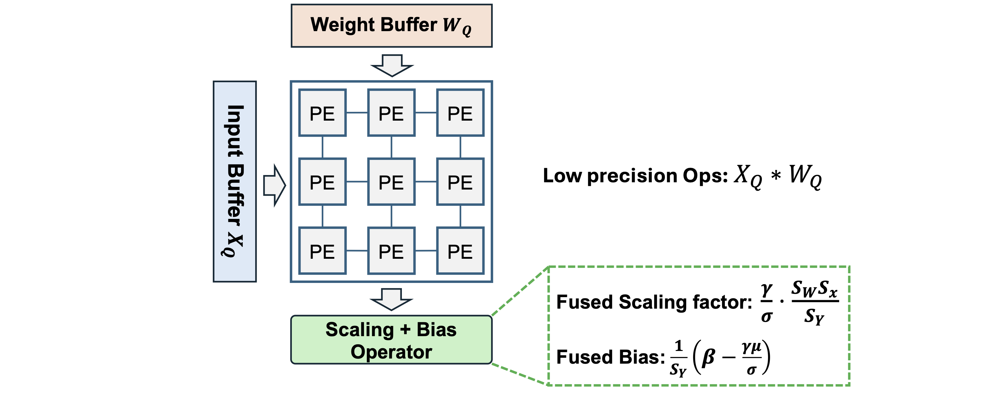

# T2C Core Modules

## `Vanilla4Compress` [[Source](https://github.com/SeoLabCornell/torch2chip/blob/61b3ef32fdd68f3d576c00bca1a4fc977ea1a18d/src/t2c/convert.py#L53)]

The pre-trained model from PyTorch, timm, and HuggingFace are mainly constructed by the vanilla `torch.nn` layers. To enable the quantization with Torch2Chip, quantizers and pruning masks should be properly assigned. As a result, converting the vanilla layers into T2C-compatible layers is critical for successful compression. 

Convert the vanilla PyTorch layer (E.g., `torch.nn.Conv2d`) into T2C layers (E.g., `QBaseConv2d`). Layer conversion is the starting point of all the subsequent compression (pruning and quantization).

```python
class Vanilla4Compress(object):
    def __init__(self, model:nn.Module, wbit:int=8, abit:int=8, state_dict:Dict=None) -> None:
        self.model = model
        self.wbit = wbit
        self.abit = abit
        self.state_dict = state_dict
```

**Attributes:**

- `model`: Vanilla pre-trained model `torch.nn.Module`.
- `wbit`: Weight precision (`int`)
- `abit`: Activation precision (`int`)
- `state_dict`: State dict of the pre-trained model (e.g., quantized, pre-trained), the pre-trained model state dict serves as the reference model dictionary to reshape the quantization parameters. 

**Methods:**

- `convert(self)`: Convert the entire vanilla model by Iterating over the model and convert the vanilla modules into T2C modules. 
- `conv(self, layer:torch.nn.Conv2d)`: Convert the vanilla `Conv2d` layer to the T2C compatibile `_QBaseConv2d`. Copy the pre-trained full-precision weights and bias to the newly-initiated layer. 
- `linear(self, layer:torch.nn.Linear)`: Convert the vanilla `Linear` layer to the T2C compatibile `_QBaseLinear`. Copy the pre-trained full-precision weights and bias to the newly-initiated layer. 
- `mlp(self, layer:Mlp)`: Convert all the `Linear` layer of the vanilla `timm.layers.Mlp` into the T2C compatibile `_QBaseLinear`. 
- `attn(self, layer:Attention)`: Convert the vanilla `timm` Attention module (`Attention`) into the T2C compatible `QAttention` module, which further enable the low precision Q, K, V, and attention via quantization. 

- `wattn(self, layer:WindowAttention)`: Convert the vanilla `timm` Window Attention module (`WindowAttention`) into the T2C compatible `QWindowAttention` module, which further enable the low precision Q, K, V, and attention via quantization. 
- `assign_quantizer(self, wqtype, xqtype)`: Assign quantizer to the converted layers based on the type of weight quantizer  (`wqtype`)  and activation quantizer (`xqtype`).
- `reshape_quantizer`: Reshape the quantization parameters with the given quantizers (weight and activation). Since 

**Example Usage: Convert the pre-trained model and prepare for quantization / pruning** 

```python
from torchvision.models import resnet50, ResNet50_Weights

# Pre-trained ResNet-50 model from PyTorch
model = resnet50(weights=ResNet50_Weights.IMAGENET1K_V1)

# Vanilla to T2C-compatible layer
converter = Vanilla4Compress(model, wbit=args.wbit, abit=args.abit)
model = converter.convert()
```

Vanilla ResNet Bottleneck block before conversion:

```python
(0): Bottleneck(
      (conv1): Conv2d(1024, 512, kernel_size=(1, 1), stride=(1, 1), bias=False)
      (bn1): BatchNorm2d(512, eps=1e-05, momentum=0.1, affine=True, track_running_stats=True)
      ...
)
```

Converted ResNet Bottleneck block **after** conversion:

```python
(0): Bottleneck(
      (conv1): _QBaseConv2d(
        1024, 512, kernel_size=(1, 1), stride=(1, 1), bias=False
        (wq): _QBase(
          nbit=8
          (observer): BaseObserver()
        )
        (aq): _QBase(
          nbit=8
          (observer): BaseObserver()
        )
        (yq): _QBase(
          nbit=8
          (observer): BaseObserver()
        )
      )
      (bn1): BatchNorm2d(512, eps=1e-05, momentum=0.1, affine=True, track_running_stats=True)
  		...
)
```

By default, the `_QBase` module act like a placeholder module with no quantization methods activated. The user-selected quantizaters will be assigned in the `PTQ` Trainer. For more details about the post-training quantization module, please refer to the **Tutorial** section. 

**Example Usage: Reload the fake-quantized model**

```python
# Define a pre-trained model (full-precision)
model = resnet50(weights=ResNet50_Weights.IMAGENET1K_V1)
wrapper = Vanilla4Compress

# Load a fully quantized model
logger.info("=> loading checkpoint...")
state_tmp = load_checkpoint(ckpt=args.resume, state=model.state_dict())

# reload_fake_quant: convert the model and assign quantizers
converter = wrapper(model, wbit=args.wbit, abit=args.abit, state_dict=state_tmp)
model = converter.reload_fake_quant(wqtype=args.wqtype, xqtype=args.xqtype)

# load the pre-trained checkpoint (fake-quantized model)
model.load_state_dict(state_tmp)
```

Vanilla ResNet Bottleneck block before conversion:

```python
(0): Bottleneck(
      (conv1): Conv2d(1024, 512, kernel_size=(1, 1), stride=(1, 1), bias=False)
      (bn1): BatchNorm2d(512, eps=1e-05, momentum=0.1, affine=True, track_running_stats=True)
      ...
)
```

After converting the vanilla layer and assign the weight and activation quantizers (fake-quantization version) with `QDrop` and `MinMaxChannelWiseWeightQuantizer`:

```python
(0): Bottleneck(
      (conv1): _QBaseConv2d(
        1024, 512, kernel_size=(1, 1), stride=(1, 1), bias=False
        (wq): MinMaxChannelWiseWeightQuantizer(
          nbit=8
          (observer): MinMaxChannelWiseWeightObserver()
        )
        (aq): QDrop(
          nbit=8, delta=1.00e+00
          (observer): LSQObserver()
        )
        (yq): _QBase(
          nbit=8
          (observer): BaseObserver()
        )
      )
      (bn1): BatchNorm2d(512, eps=1e-05, momentum=0.1, affine=True, track_running_stats=True)
  	  ...
)
```

The conversion between the vanilla layer (`torch.nn`) and the T2C layer is **required** for conversion and post-compression conversion. 

### `ViTV4C` [[Source](https://github.com/SeoLabCornell/torch2chip/blob/61b3ef32fdd68f3d576c00bca1a4fc977ea1a18d/src/t2c/convert.py#L241)]

Vanilla to T2C model conversion designed for vision transformer (ViT) models, compatible for **both** swin transformer and conventional ViT model architecture, inherited from `Vanilla4Compress`. 

```python
class ViTV4C(Vanilla4Compress):
    def __init__(self, model: nn.Module, wbit: int = 8, abit: int = 8, state_dict:Dict = None) -> None:
        super().__init__(model, wbit, abit, state_dict)
```

**Attributes:**

- `model`: Vanilla pre-trained vision transformer model (`torch.nn.Module`).
- `wbit`: Weight precision (`int`)
- `abit`: Activation precision (`int`)
- `state_dict`: State dict of the pre-trained model (e.g., quantized, pre-trained), the pre-trained model state dict serves as the reference model dictionary to reshape the quantization parameters. 

**Methods:**

- `reshape_quantizer`: Reshape the quantization parameters based on the reference parameter dictionary (`self.state_dict`).
- `assign_quantizer`: Assign quantizers to Attention and MLP modules of the transformer model.

### `BERT4Compress` [[Source](https://github.com/SeoLabCornell/torch2chip/blob/61b3ef32fdd68f3d576c00bca1a4fc977ea1a18d/src/t2c/convert.py#L349)]

Vanilla to T2C model conversion for BERT model, inherited from `Vanilla4Compress`. 

```python
class BERT4Compress(Vanilla4Compress):
    def __init__(self, model: nn.Module, wbit: int = 8, abit: int = 8, state_dict: Dict = None) -> None:
        super().__init__(model, wbit, abit, state_dict)

        self.config = self.model.config
```

**Attributes:**

- `model`: Vanilla pre-trained BERT model (`torch.nn.Module`), must be a HuggingFace pre-trained checkpoint. 
- `wbit`: Weight precision (`int`)
- `abit`: Activation precision (`int`)
- `state_dict`: State dict of the pre-trained model (e.g., quantized, pre-trained), the pre-trained model state dict serves as the reference model dictionary to reshape the quantization parameters. 

**Methods:**

- `bert_attn(self, layer:BertSelfAttention)`: Convert the vanilla BERT Self-Attention module into T2C "compressable" attention module. 
- `bert_output(self, layer:BertSelfOutput)`: Convert the fully connected layer of the vanilla BERT output MLP block into T2C "compressable" linear layer `_QBaseLinear`. 

## `T2C` [[Source](https://github.com/SeoLabCornell/torch2chip/blob/61b3ef32fdd68f3d576c00bca1a4fc977ea1a18d/src/t2c/t2c.py#L39)]

Applies post-compression (e.g., Post-training quantization) conversion with a given fake-compressed model. 

```python
class T2C(object):
    def __init__(self, model:nn.Module, swl:int, sfl:int, args):
        self.swl = swl
        self.sfl = sfl
        self.args = args

        self.swl = swl
        self.sfl = sfl
        self.args = args

        # model fusion
        fuser = FUSERS[str(args.model)](model)

        # switch to inference mode
        fuser.inference()
        
        # fuse layers
        fused_model = fuser.fuse()
        self.model = fused_model
```

`T2C` module converts a pre-trained fake-quantized model into a hardware-deployable model with low precision only operation. 

**Attributes:**

- `model`: Pre-trained fake-quantized model. 
- `swl`: Total bitwidth of the fused scaling factor. 
- `sfl`: Fractional bitwidth of the fused scaling factor. 
- `args`: Argument holder (Argparse)
- `sparsity`: Weight sparsity. 

**Methods:**

- `compute_sparsity`:  Compute the weight sparsity of the given model `self.model`.
- `scale_bias2int`:  Convert the floating point scaling factor (fused quantization + normalization) and bias into fixed point integer, with the total bitwidth `self.swl` and fractional bitwidth `self.sfl`. 
- `fused_model`: Return the converted model with low precision-only operations and fixed-point integer scaling factor and bias. 
- `export`: Export the converted model by fetching and saving the intermediate operator (`ops`) results (input and output). 
- `bert_export`: Export the converted BERT model by fetching and saving the intermediate operator (`ops`) results (input and output).

### Example Usage

```python
# Step 1. Define the model architecture
model = vit_small_patch16_224(pretrained=True)
wrapper = ViTV4C

# Step 2. Reconfigure the fake-quantization quantizers
converter = wrapper(model, wbit=args.wbit, abit=args.abit, state_dict=state_tmp)
model = converter.reload_fake_quant(wqtype=args.wqtype, xqtype=args.xqtype)

# Step 3. Load the pre-trained checkpoint
state_tmp = load_checkpoint(ckpt=args.resume, state=model.state_dict())
model.load_state_dict(state_tmp)
```

After defining the model architecture and reload the quantizers, the quantizers (in the fake-quantization mode) are properly inserted into the model:

```python
(attn): QAttention(
    (qkv): _QBaseLinear(
      in_features=384, out_features=1152, bias=True
      (wq): AdaRound(
        nbit=8
        (observer): AdaRoundObserver()
      )
      (aq): _QBase(
        nbit=8
        (observer): BaseObserver()
      )
    (q_norm): Identity()
    (k_norm): Identity()
    (attn_drop): Dropout(p=0.0, inplace=False)
    (proj): _QBaseLinear(
      in_features=384, out_features=384, bias=True
      (wq): AdaRound(
        nbit=8
        (observer): AdaRoundObserver()
      )
      (aq): _QBase(
        nbit=8
        (observer): BaseObserver()
      )
    )
    (proj_drop): Dropout(p=0.0, inplace=False)
    (qkv_scale): MulShift()
    (qkv_deq): MulShift()
    (attn_scale): MulShift()
    (xq): LSQTokenWise(
      nbit=8, delta_mean=6.12e-02
      (observer): LSQTokenWiseObserver()
    )
    (qqkv): LSQTokenWise(
      nbit=8, delta_mean=8.10e-02
      (observer): LSQTokenWiseObserver()
    )
    (qproj): LSQTokenWise(
      nbit=8, delta_mean=3.87e-02
      (observer): LSQTokenWiseObserver()
    )
  )
```

By converting the model via `T2C`, the computation of the forward pass will be executed through the evaluation branch (`evalFunc`) with low-precision only operations (`ops`). The quantization and dequantization scaling are fused into the `MulShift` and `MulQuant` modules (see below for more details). 

```python
# Step 4. T2C
t2c = T2C(model=model, swl=args.swl, sfl=args.sfl, args=args)
qmodel = t2c.fused_model()
```

After the T2C conversion:

```python
(attn): QAttention(
    (qkv): _QBaseLinear(
      in_features=384, out_features=1152, bias=True
      (wq): AdaRound(
        nbit=8
        (observer): AdaRoundObserver()
      )
      (aq): _QBase(
        nbit=8
        (observer): BaseObserver()
      )
      (ops): IntMatMul()
    )
    (q_norm): Identity()
    (k_norm): Identity()
    (attn_drop): Dropout(p=0.0, inplace=False)
    (proj): _QBaseLinear(
      in_features=384, out_features=384, bias=True
      (wq): AdaRound(
        nbit=8
        (observer): AdaRoundObserver()
      )
      (aq): _QBase(
        nbit=8
        (observer): BaseObserver()
      )
      (ops): IntMatMul()
    )
    (proj_drop): Dropout(p=0.0, inplace=False)
    (qkv_scale): MulShift()
    (qkv_deq): MulShift()
    (attn_scale): MulShift()
    (xq): LSQTokenWise(
      nbit=8, delta_mean=4.63e-02
      (observer): LSQTokenWiseObserver()
    )
    (qqkv): MulQuant()
    (qproj): MulQuant()
  	(qk): IntMatMul()
    (attnv): IntMatMul()
  )
```

The model conversion and fusion process of T2C aims to isolate the bottom-level basic operators (e.g., MatMul) on the top level, so the observability of the operation can be ensured for hardware design and verification. 

As shown in the example of `QAttention` above, all the matrix multiplication operations (Fully-connected layer, Query x Key, etc) has been isolated into the matrix multiplication operator `IntMatMul`. 

In the meantime, the quantizers (`qqkv`, `qproj`)  are converted into the `MulQuant` module, which collectively performs dequantization + quantization. **In hardware implementation,** the `MulQuant` operator corresponds to the scaling + rounding operator. 

## `Fuser`

Layer fusers are critical to convert the fake-quantized computation into the actual quantized operation. More importantly, the basic operator of each type of layer(e.g., `MatMul` in  `torch.nn.Linear`) is **isolated** on the top level. As a result, the `T2C` module can fetch and extract the intermediate input and output for hardware verification with actual low-precision tensors. 

#### `LayerFuser` [[Source](https://github.com/SeoLabCornell/torch2chip/blob/dfd075b853c85af830d82a6feffd652cda0e0bc8/src/t2c/fusers/fusers.py#L13)]

```python
class LayerFuser(object):
    def __init__(self, model:nn.Module):
```

Fuse the layers between `conv`, `quantizer`, and `batchnorm`, the base class for all the other model-specific fusers. 

**Attributes / Methods:**

- `model`: DNN model with T2C layers.
- `inference(self)` : Switch the model to the inference mode. 

#### Fusion between Conv, BN, and ReLU

Given a sequence of Conv, BatchNorm, and ReLU layers, the dequantization and the normalization layer can be fused as a channel-wise scaling and bias adding process. Specifically, given the quantized weight \(W_Q\) and activation \(X_Q\), the final output can be characterized as:
$$
Y = Round(\frac{\gamma}{\sigma}\frac{S_XS_W}{S_Y}(X_Q * W_Q) + \frac{1}{S_Y}(\beta - \frac{\gamma \mu}{\sigma}))
$$
Where \(\gamma\),  \(\sigma\) , \(\beta\), and \(\mu\) represents the weight, running variance, bias, and running mean of the BatchNorm module. 

 It is easy to tell that the low precision operation (\(X_Q *W_Q\)) is executed in the dedicated computation engine, while the post-computation scaling and bias adding are deployed to the high-precision operator. Conceptually, the overall hardware architecture can be generalized as:



Where the fused scaling factor and fused bias tensors can be quantized into fixed-point representation (`scale_bias2int`) with high precision representation (e.g., INT16). 

### `QConvBNReLU` [[Source](https://github.com/SeoLabCornell/torch2chip/blob/dfd075b853c85af830d82a6feffd652cda0e0bc8/src/module/fuse.py#L75)]

```python
class QConvBNReLU(nn.Module):
    r"""
    Template of module fusion
    """
    def __init__(self, in_channels:int, out_channels:int, kernel_size:int, stride:int=1, 
                padding:int=0, dilation:int=1, groups:int=1, bias:bool=True, wbit:int=32, 
                abit:int=32, train_flag=True, int_out=True):
        super(QConvBNReLU, self).__init__()
        
        # modules
        self.conv = _QBaseConv2d(in_channels, out_channels, kernel_size, stride, padding, dilation, groups, bias, wbit, abit, train_flag)
        self.bn = nn.BatchNorm2d(out_channels)
        self.relu = nn.Identity()

        # flag
        self.int_out = int_out
        self.scale = torch.tensor(1.0)

        # precision
        self.abit = abit
        
        # scaler
        self.scaler = MulShift()
```

For Convolutional Neural Network, the sequence of `_QBaseConv2d`, `BatchNorm2d`, and `ReLU` layers are collectively "fused" into the `QConvBNReLU` layer.

The combined scaling factor is fused into the `scaler` , while the convolution is perfomed with the quantized low precision tensors (weight and activation). 

```python
def forward(self, inputs:torch.Tensor) -> torch.Tensor:
    x = self.conv(inputs)
    x = self.scaler(x)
    x = self.relu(x)
    return x
```

### `MulShift` [[Source](https://github.com/SeoLabCornell/torch2chip/blob/dfd075b853c85af830d82a6feffd652cda0e0bc8/src/module/fuse.py#L9)]

```python
class MulShift(nn.Module):
    r"""Multiply the scaling factor and add the bias
    
    Attributes:
    scale: Scaling factor with the shape of output channels.
    bias: Bias value. 
    fl: Fractional bits of the high-precision integer.
    """
    def __init__(self):
        super(MulShift, self).__init__()
        self.register_buffer("scale", torch.tensor(1.0))
        self.register_buffer("bias", torch.tensor(0.0))

        # fractional bit width
        self.fl = 0.

    def inference(self):
        pass

    def forward(self, x:torch.Tensor):
        out = x.mul(self.scale).add(self.bias)
        out = out.mul(2**(-self.fl))
        return out
```

Multiply the scaling factor and adding bias of the input tensor from the previous computation step (e.g., Convolution or MatMul). 

**In particular,** if the scaling factor and bias are quantized to the fixed point high-precision integer format, the scaled tensor will be right shifted by the number of fractional bits. 

### `MulQuant` [[Source](https://github.com/SeoLabCornell/torch2chip/blob/dfd075b853c85af830d82a6feffd652cda0e0bc8/src/module/fuse.py#L33)]

```python
class MulQuant(nn.Module):
    r"""Multiply the scaling factor and add the bias, then quantize the output.

    Attributes:
    scale: Scaling factor with the shape of output channels.
    bias: Bias value. 
    fl: Fractional bits of the high-precision integer.
    """
    def __init__(self, nbit:int=8, unsigned=False):
        super(MulQuant, self).__init__()
        self.register_buffer("scale", torch.tensor(1.0))
        self.register_buffer("bias", torch.tensor(0.0))
        self.register_buffer("zero_point", torch.tensor(0.0))

        self.nbit = nbit
        self.unsigned = unsigned

        # upper and lower bound
        if not self.unsigned:
            self.qlb = -2**(self.nbit-1)
            self.qub = 2**(self.nbit-1) - 1
        else:
            self.qlb = 0
            self.qub = 2**(self.nbit) - 1

        # fractional bit width
        self.fl = 0.

    def inference(self):
        pass

    def forward(self, x:torch.Tensor):
        # scale
        out = x.mul(self.scale)
        out = out.add(self.bias).mul(2**(-self.fl)).round()
        
        # quant
        out = out.add(self.zero_point)
        out = out.clamp(min=self.qlb, max=self.qub).sub(self.zero_point)
        
        return out.clamp(min=self.qlb, max=self.qub)
```

Multiply the scaling factor and adding bias of the input tensor from the previous computation step (e.g., Convolution or MatMul), **then round the scaled tensor to formulate the quantized low precision output.**

**In particular,** if the scaling factor and bias are quantized to the fixed point high-precision integer format, the scaled tensor will be right shifted by the number of fractional bits. 

### Convolutional Neural Network

#### `ResNet18Fuser` [[Source](https://github.com/SeoLabCornell/torch2chip/blob/dfd075b853c85af830d82a6feffd652cda0e0bc8/src/t2c/fusers/resnet.py#L4)]

```python
class ResNet18Fuser(LayerFuser):
    def __init__(self, model: nn.Module):
        super().__init__(model)
```

Apply layer-wise fusion for the ResNet-18 model. Iterating over the ResNet `BasicBlock` and fuse the `_QBaseConv2d`, `BatchNorm2d`, and `ReLU` layers. The resultant model performs the convolution of each layer with quantized tensors only (weight and activation) through the inference path (`evalFunc`).

#### `ResNet34Fuser` [[Source](https://github.com/SeoLabCornell/torch2chip/blob/dfd075b853c85af830d82a6feffd652cda0e0bc8/src/t2c/fusers/resnet.py#L57)]

```python
class ResNet34Fuser(ResNet18Fuser):
    def __init__(self, model: nn.Module):
        super().__init__(model)
```

Apply layer-wise fusion for the ResNet-34 model. Iterating over the ResNet `BasicBlock` and fuse the `_QBaseConv2d`, `BatchNorm2d`, and `ReLU` layers. The resultant model performs the convolution of each layer with quantized tensors only (weight and activation) through the inference path (`evalFunc`).

**Note:** Since the ResNet-34 and ResNet-18 shares the same basic module (`BasicBlock`), `ResNet34Fuser` and `ResNet18Fuser` are sharing the same fusing strategy. 

#### `ResNet50Fuser` [[Source](https://github.com/SeoLabCornell/torch2chip/blob/dfd075b853c85af830d82a6feffd652cda0e0bc8/src/t2c/fusers/resnet.py#L61)]

```python
class ResNet50Fuser(LayerFuser):
    def __init__(self, model: nn.Module):
        super().__init__(model)
```

Apply layer-wise fusion for the ResNet-50 model. Iterating over the ResNet `BottleneckBlock` and fuse the `_QBaseConv2d`, `BatchNorm2d`, and `ReLU` layers. The resultant model performs the convolution of each layer with quantized tensors only (weight and activation) through the inference path (`evalFunc`).

#### `MobileNetV1Fuser` [[Source](https://github.com/SeoLabCornell/torch2chip/blob/dfd075b853c85af830d82a6feffd652cda0e0bc8/src/t2c/fusers/mobilenet.py#L6)]

```python
class MobileNetV1Fuser(LayerFuser):
    def __init__(self, model: nn.Module):
        super().__init__(model)
```

Apply layer-wise fusion for the MobileNet-V1 model. Iterating over the model and fuse the  `_QBaseConv2d`, `BatchNorm2d`, and `ReLU` layers. For the convolutional layers, **both** depth-wise and point-wise layers are fused properly. The resultant model performs the convolution of each layer with quantized tensors only (weight and activation) through the inference path (`evalFunc`)

#### `VGGFuser` [[Source](https://github.com/SeoLabCornell/torch2chip/blob/dfd075b853c85af830d82a6feffd652cda0e0bc8/src/t2c/fusers/vgg.py#L5)]

```python
class VGGFuser(LayerFuser):
    def __init__(self, model: nn.Module):
        super().__init__(model)
```

Apply layer-wise fusion for the VGG model. Iterating over the model and fuse the  `_QBaseConv2d`, `BatchNorm2d`, and `ReLU` layers. The resultant model performs the convolution of each layer with quantized tensors only (weight and activation) through the inference path (`evalFunc`). 

### Transformer

#### `ViTFuser` [[Source](https://github.com/SeoLabCornell/torch2chip/blob/dfd075b853c85af830d82a6feffd652cda0e0bc8/src/t2c/fusers/vit.py#L11)]

```python
class ViTFuser(object):
    def __init__(self, model: nn.Module):
        self.model = model.eval()
```

Iterate over the `VisionTransformer` model and fuse the `Attention` and `MLP` modules and enable the integer-only operations. 

Different from the fusion for convolutional neural networks, the post-training fusion of the transformer model ensures the low precision operations inside both MLP and Attention modules:

**Attention Module:**

- Low precision operation of the QKV projection `qkv` (low precision weight + activation).
- Low precision MatMul between Q and K. 
- Low precision output of SoftMax function. 
- Low precision MatMul between Attention and V. 
- Low precision Projection layer. 

**MLP:**

- Low precision MatMul operation of fully-connected layers (`fc1` and `fc2`).

The forward pass will be executed through the evaluation path (`evalFunc`) of the `QAttention` module with integer-only MatMul operations. 

#### `SwinFuser` [[Source](https://github.com/SeoLabCornell/torch2chip/blob/dfd075b853c85af830d82a6feffd652cda0e0bc8/src/t2c/fusers/vit.py#L148)]

```python
class SwinFuser(ViTFuser):
    def __init__(self, model: nn.Module):
        super().__init__(model)
```

Model fuser for SwinTransformer. Fuse the SwinAttention and MLP modules and enable the integer-only computations. Similar to the `ViTFuser`, the forward pass fo the converted SwinTransformer model follows the evaluation path (`evalFunc`) with the following integer-only operations:

**Attention Module:**

- Low precision operation of the QKV projection `qkv` (low precision weight + activation).
- Low precision MatMul between Q and K. 
- Low precision output of SoftMax function. 
- Low precision MatMul between Attention and V. 
- Low precision Projection layer. 

**MLP:**

- Low precision MatMul operation of fully-connected layers (`fc1` and `fc2`).
